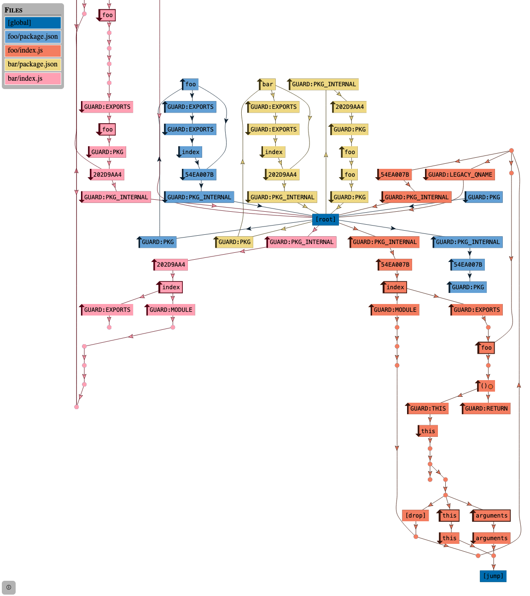

# How package structure is modeled

_This is WIP and only contains links to the example, no explanation yet._

An [example](package-structure/example.js) test shows a basic setup with a package `foo` exporting a function `foo`, and a package `bar` depending on `foo` and importing the function.

The stack graph for this example looks as follows:

_Generate this yourself by running `cargo run --features cli -- test --save-graph='%d/%n.html' --output-mode=always docs/package-structure/example.js`._
